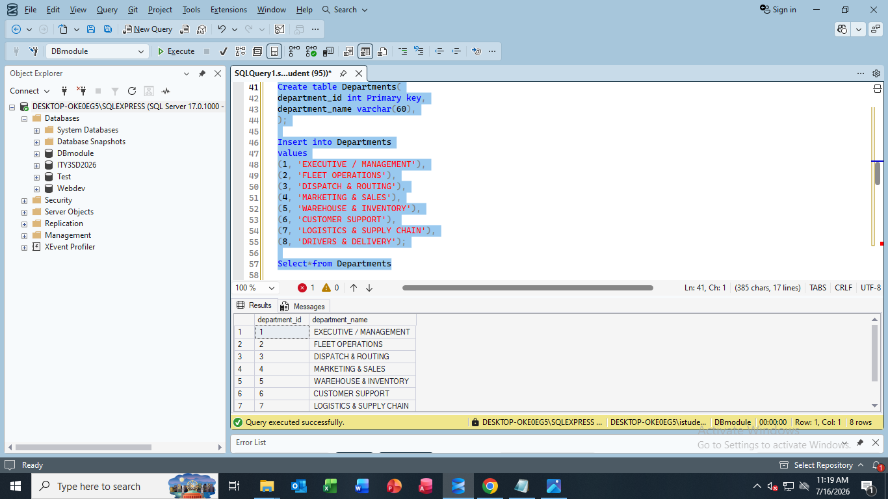
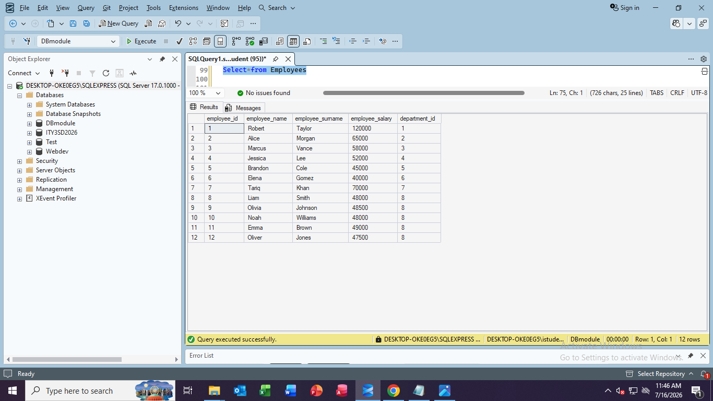
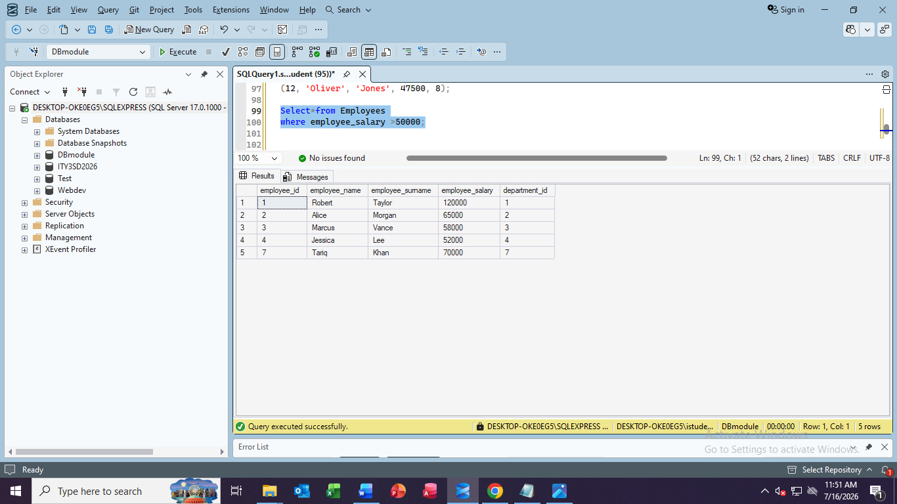
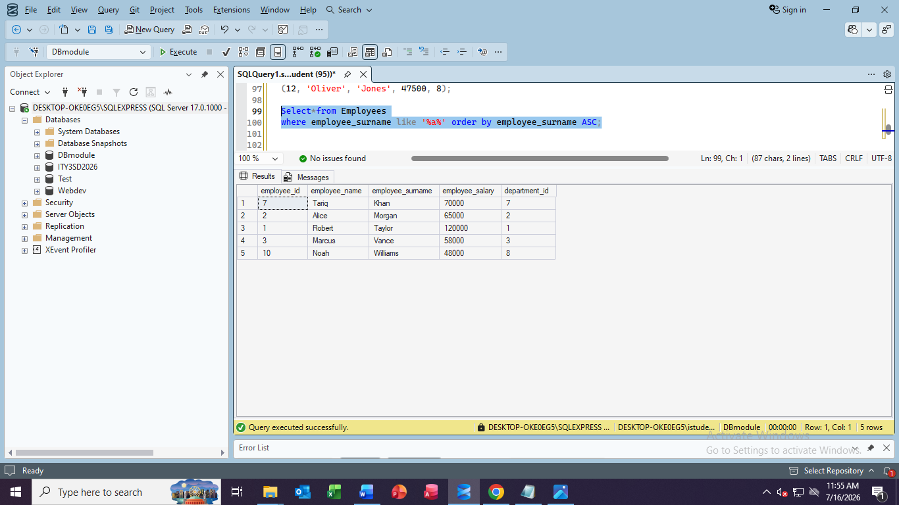
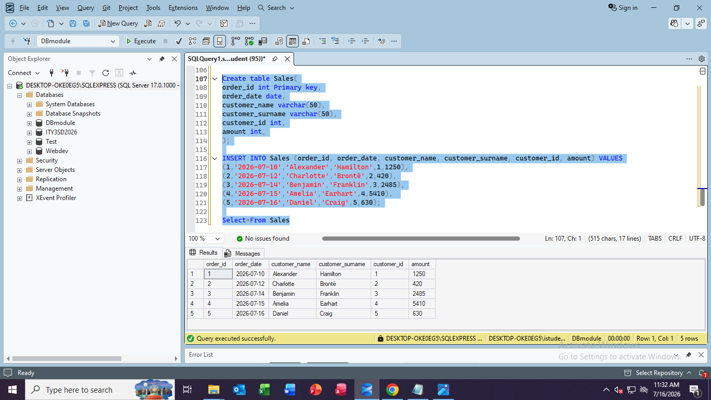
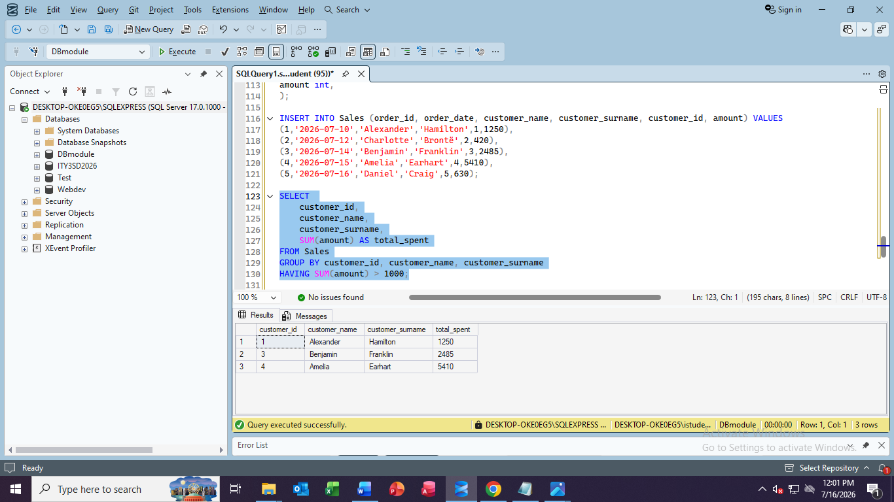
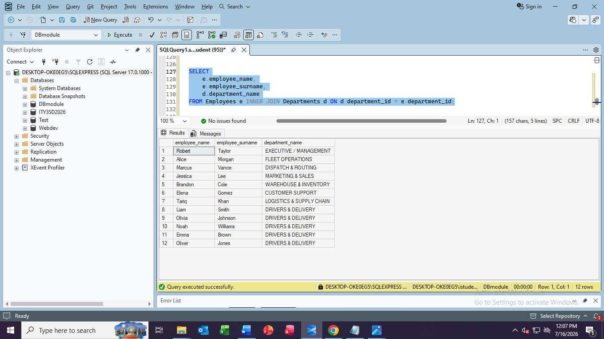
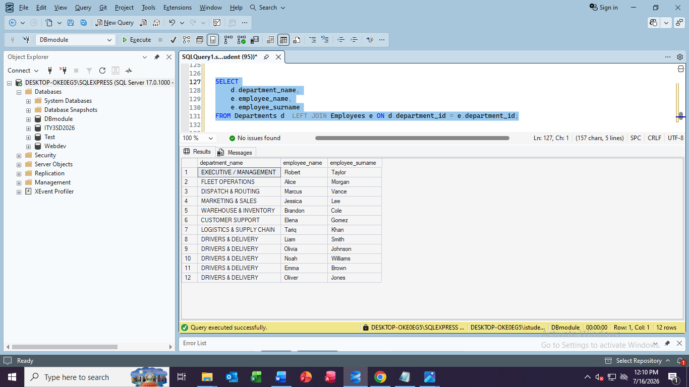

# Database Creation and Manipulation Labs
<b>Scenario:</b> A local delivery company has asked me create a database with desgnated tables to be able to store information about the company(empoyees, customers, finances). The problem they have is having to document everything on paper, they now wnat to store information in a efficient way, A way that will not only allow them to store information, a way that will also allow them to retrieve inforation quickly.

<b>My approach:</b> I will create these tables with efficiency in mind, I wnat to link certain tables to one another so that one can easily use a join query to fetch all information linked to the "id" maybe, how I will do this is by using foreign keys, linking a primary key form another table to another table which has its information and its own primary key this will allow me to easily pull all data using that foreign key. Here is a simplified example of this, imagine that there is a table called Departments with the columns [departmentid, departmentname] and then we have another table called Employees which will has [employeeid, employeename, employeesurname, salary] but then now to know which department an employee is linked to I need to link these tables by using the Department table (departmentid) as a foreign key in the Employee table so when I use a Join query I can pull all info linked to the employee including the department they are in. Employee table final structure [employeeid, employeename, employeesurname, salary, departmentid(FOREIGN KEY)].

# Application
Creating the Database and a table to store the local delivery company's drivers:

 
Creating a Vehicles table with the approach we mentioned earlier, I used a foreign key to link it to the driver:

 
Created the Departments table:

Created a Employees table with the approach we mentioned earlier, I used a foreign key to link each employee to their department:

Running the SELECT*FROM Employees, to verify eveything is there:

Manipulating and filtering the data that I recieve from the Employees table( I wanna see every employee that is recieving a salary more than R50 000):

Manipulating and filtering the data that I recieve from the Employees table(I want to recieve every employee whose lastname has an '%a%' in it):

Creating a table to keep track of Sales:

Writing a SELECT query that gives me the total revenue and average order price I that is recieved form Sales:

Categerozing by customer_id to recieve the total each customer spent:

Witing a <i>INNER JOIN</i> query which now pulls employees details from Employees table and then using the foreign key I created to also get the the department they are in, all in once:

Witing a <i>LEFT JOIN</i> query which now pulls employees details from Employees table and then using the foreign key I created to also get the the department they are in, all in once, but this time the Department name is on the left:

